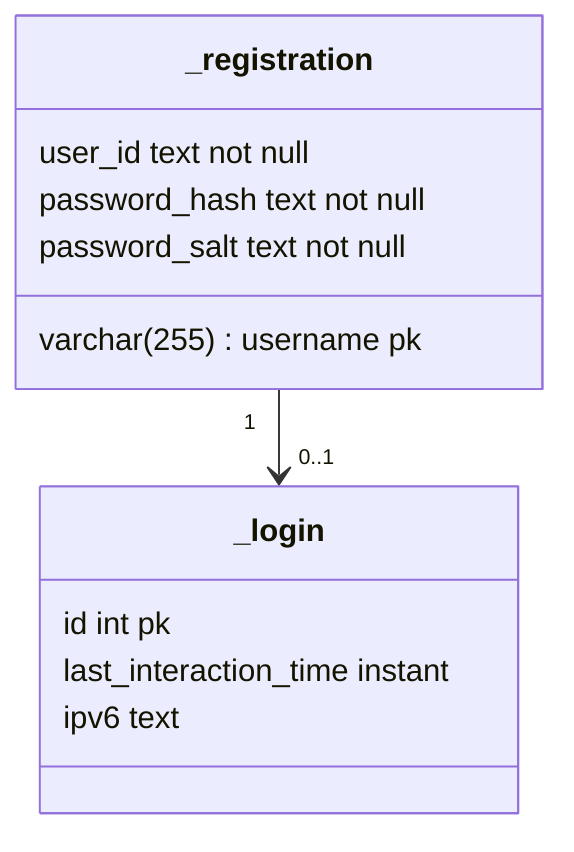

# How will we do user authentication

We will store registrations in a table.

We will store logged in users in a table

User ID (personal page name): base 64 encode of random string

Username max length : 255
Password max length: 255

## Login

Input : username, password

1. username not in database: error 'Utilisateur inconnu. Inscrivez-vous'
2. user already logged in: error 'Tentative de connexion malicieuse détectée'
3. user password does not correspond: error 'Mot de passe incorrect'
4. login success: go to user's personal page

## Register

Input : username, password, confirm_password

1. password too long: error 'mot de passe trop long (255 caractères max.)'
2. username too long: error 'nom d'utilisateur trop long (255 caractères max.)'
3. password and confirm_password not equal: error 'confirmation différente du mot de passe'
4. username already in database: 'nom d'utilisateur déjà pris'
5. register success: add to database and go to user's personal page.

## Login-required pages

If an user personal page is accessed, redirect to homepage if the logged in user's IP is not this IP.

## Logging out

Explictly : set logon

Implicitly: timeout: after each interaction, set timeout in 5 hours, log out. Remove existing timeout

An interaction: an user accessing a page (timeout _login where ip is current ip)
